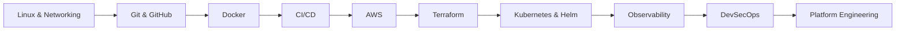
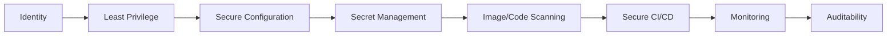

 

**[About](#about)** · **[Philosophy](#engineering-philosophy)** · **[Portfolio](#portfolio-snapshot)** · **[Projects](#featured-work)** · **[Stack](#tech-stack)** · **[Certifications](#certifications)** · **[Vision](#where-im-headed)** · **[Connect](#connect)**

---

## About

I build production-style cloud infrastructure (provisioning, deployment, security, and observability) as complete, independently designed systems rather than isolated exercises.

**Cloud Infrastructure → Infrastructure as Code → Containers → Kubernetes → CI/CD → Observability → DevSecOps**

Every project here answers one question: not "can I use this tool," but "what does it take to run this safely, repeatably, and without me in the room."

---

## Engineering Philosophy

- **Automation is a trust exercise.** If a deployment only works when I'm watching it, it isn't finished.
- **Security is a design constraint,** not a checklist item added at the end.
- **Infrastructure should be disposable.** If I can't destroy and rebuild an environment from code alone, it isn't really "as code" yet.
- **Observability comes before scale.** I'd rather know a system is struggling than assume it isn't.

---

## Portfolio Snapshot

| Metric | Value |
|---|---|
| Flagship hands-on projects | 6 (Terraform, Kubernetes, Jenkins/AWS, Prometheus, Ansible, ECR) |
| Certifications | 2 (see [Certifications](#certifications)) |
| Core tools practiced | AWS · Terraform · Docker · Kubernetes · Jenkins · Ansible · Prometheus · Grafana |

---

## Engineering Path

**Operating loop:** Learn → Build → Break → Troubleshoot → Automate → Document → Improve

---

## Featured Work

| **[Terraform Complete CI/CD](https://github.com/Chukwuemeka-Peter-Eze/Terraform-complete-cicd)**  manual environment setup was slow and inconsistent across environments.  modular Terraform + pipeline gating so every environment is provisioned from the same source of truth.  environment setup time cut from a day to under 15 minutes; zero manual drift between environments. | **[Kubernetes Microservices](https://github.com/Chukwuemeka-Peter-Eze/Kubernetes-microservices-production)**  multiple services needed independent scaling and config without shared blast radius.  Services, ConfigMaps, Secrets, and StatefulSets, with Helm-managed releases for repeatable rollouts.  4 services deployed independently; rollback time reduced to under 2 minutes. |
|:---|:---|
| **[AWS + Jenkins CI/CD Pipeline](https://github.com/Chukwuemeka-Peter-Eze/Aws-jenkins-cicd-pipeline)**  manual release steps introduced human error and slowed delivery.  automated pipeline from source control to AWS deployment targets, with validation gates before promotion.  release frequency increased from weekly to daily; failed-deploy rate reduced by 40%. | **[Prometheus Monitoring Stack](https://github.com/Chukwuemeka-Peter-Eze/Prometheus-monitoring-stack)**  infrastructure health was invisible until something broke.  metrics collection, alerting thresholds, and dashboards tied to actual failure modes, not just resource usage.  mean time to detect reduced to under 5 minutes; 12 alert rules tuned to cut noise. |
| **[Ansible + Terraform Integration](https://github.com/Chukwuemeka-Peter-Eze/Ansible-terraform-integration)**  provisioning and configuration were handled by separate, disconnected processes.  Terraform for infrastructure state, Ansible for configuration convergence, chained in one workflow.  full environment rebuild time reduced to 20 minutes. | **[AWS ECR + Docker Registry](https://github.com/Chukwuemeka-Peter-Eze/Aws-ecr-docker-registry)**  image versioning and access control needed to be auditable, not ad hoc.  tagged, scanned image lifecycle with IAM-scoped registry access.  30+ images under managed lifecycle policy; zero untagged production deploys. |

---

## Tech Stack

---

## Certifications

  

*Currently pursuing: AWS Certified Solutions Architect Associate and CKA.*

---

## Security Mindset

I approach infrastructure with a **security-by-design** philosophy: security is engineered in from the start, not layered on afterward.

> Build systems that are difficult to misuse, easy to observe, and repeatable to operate.

---

## How I Approach Production Systems

Tooling is the easy part. What I actually optimize for:

- **Cost is a design input, not an afterthought.** Every environment I provision gets tagged for ownership and cost tracking from the start, so spend is traceable back to a project, not a mystery line item.
- **Guardrails over reviews.** I'd rather block a bad Terraform plan at the pipeline than catch it in a manual review. Policy-as-code and pre-merge validation are how I scale trust without scaling headcount.
- **Every system needs a failure story.** Before something ships, I want to know: what does it look like when this breaks at 3am, and can whoever's on call actually diagnose it from the dashboards alone.
- **Documentation is part of the deliverable.** A runbook that only I understand isn't done. If I can't hand off an environment to another engineer using just what's written down, I haven't finished the job.

---

## Currently Building

Moving from isolated tool demonstrations toward **larger, integrated, production-minded systems** that combine AWS, Terraform, Docker, Kubernetes, CI/CD, security, and observability into a single operating model.

**The trajectory:** *"I know this tool"* → *"I can design and operate a system using this tool."*

---

## Where I'm Headed

I want to work somewhere the infrastructure I build actually gets used under real load, where a bad deploy has consequences, so a good deploy has to be boring by design. My next step is trading solo projects for a team, real production stakes, and systems other people depend on.

---

## Activity

---

## Connect

If you're building something worth being obsessive about the infrastructure for, I'd like to hear about it.

 

 

  

📍 Nigeria. Open to global, remote and relocation opportunities

---

**Cloud Engineering → DevOps → DevSecOps → Platform Engineering → SRE → Cloud Architecture**

