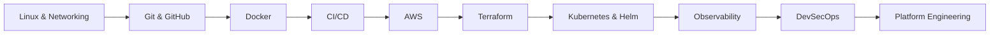
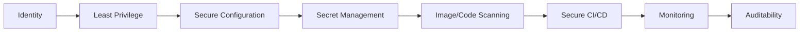

 

---

## About

I build hands-on, production-style cloud infrastructure projects, from provisioning through deployment, security, and observability, trained through **TechWorld with Nana's DevOps Bootcamp** and extended independently across my own repositories. My focus sits at the intersection of:

**Cloud Infrastructure → Infrastructure as Code → Containers → Kubernetes → CI/CD → Observability → DevSecOps**

Each project below is a deliberate, self-built exercise in how infrastructure is provisioned, how code moves safely into production, how failures are detected and recovered from, and how access and secrets stay secure, the same fundamentals that scale into real operational environments.

> I don't just learn tools, I build systems with them, one project at a time.

---

## Portfolio Snapshot

| Metric | Value |
|---|---|
| Public repositories | 37 |
| Flagship hands-on projects | 6 (Terraform, Kubernetes, Jenkins/AWS, Prometheus, Ansible, ECR) |
| Training background | TechWorld with Nana - DevOps Bootcamp; Digital Witch Support Community - Cloud Security & DevOps Engineer |
| Core tools practiced | AWS, Terraform, Docker, Kubernetes, Jenkins, Ansible, Prometheus, Grafana |
| Focus | Applying bootcamp fundamentals to independently designed, production-style builds |

---

## Focus Areas

| Domain | Stack | Description |
|---|---|---|
| ☁️ **Cloud Engineering** | AWS (EC2, ECR, IAM, CloudWatch) | Secure, repeatable cloud environments provisioned with operational awareness |
| 🏗️ **Infrastructure as Code** | Terraform, CloudFormation | Version-controlled, reproducible infrastructure over manual configuration |
| ☸️ **Containers & Orchestration** | Docker, Kubernetes, Helm | Containerized workloads and production-grade Kubernetes operations |
| 🔄 **CI/CD & Delivery** | Jenkins, GitHub Actions | Automated pipelines from source → build → validate → deploy |
| 🔐 **DevSecOps** | IAM, Secrets Mgmt, Scanning | Security embedded into the engineering workflow, not bolted on after |
| 📊 **Observability** | Prometheus, Grafana, CloudWatch | Metrics and monitoring so infrastructure never runs as a black box |

---

## Engineering Path

**Operating loop:** Learn → Build → Break → Troubleshoot → Automate → Document → Improve

---

## Selected Case Studies

**Terraform Complete CI/CD**
Provisioned and version-controlled infrastructure end-to-end, replacing manual environment setup with a repeatable, auditable pipeline from commit to deployment.
📎 [View repository](https://github.com/Chukwuemeka-Peter-Eze/Terraform-complete-cicd)

**Kubernetes Microservices**
Built and deployed a multi-service application on Kubernetes, services, ConfigMaps, Secrets, and StatefulSets with Helm-managed releases, modeled on production patterns.
📎 [View repository](https://github.com/Chukwuemeka-Peter-Eze/Kubernetes-microservices-production)

**AWS + Jenkins CI/CD Pipeline**
Built an automated delivery pipeline connecting source control to AWS deployment targets, replacing manual release steps with a Jenkins-driven workflow.
📎 [View repository](https://github.com/Chukwuemeka-Peter-Eze/Aws-jenkins-cicd-pipeline)

---

## More Projects

| Project | Focus |
|---|---|
| [**Prometheus Monitoring Stack**](https://github.com/Chukwuemeka-Peter-Eze/Prometheus-monitoring-stack) | Metrics, alerting & operational visibility |
| [**Ansible + Terraform Integration**](https://github.com/Chukwuemeka-Peter-Eze/Ansible-terraform-integration) | Provisioning + configuration automation |
| [**AWS ECR + Docker Registry**](https://github.com/Chukwuemeka-Peter-Eze/Aws-ecr-docker-registry) | Container image management & cloud-native workflows |

---

## Technical Portfolio

<table>
<tr>
<td valign="top" width="33%">

**☁️ Cloud**
- EC2 deployments
- ECR container registry
- IAM configuration
- AWS CLI automation
- Linux cloud administration

</td>
<td valign="top" width="33%">

**🐳 Containers**
- Docker images & volumes
- Docker networking & Compose
- Multi-container apps
- Container registries

</td>
<td valign="top" width="33%">

**☸️ Kubernetes**
- Deployments & Services
- ConfigMaps & Secrets
- StatefulSets
- Helm charts

</td>
</tr>
<tr>
<td valign="top" width="33%">

**🔄 CI/CD**
- Jenkins pipelines & shared libraries
- GitHub Actions
- Artifact management
- Deployment automation

</td>
<td valign="top" width="33%">

**🏗️ Infrastructure Automation**
- Terraform & CloudFormation
- Ansible
- Configuration management
- AWS automation (Python/Boto3)

</td>
<td valign="top" width="33%">

**📊 Observability**
- Prometheus & Grafana
- Alerting
- Infrastructure & app metrics
- Operational dashboards

</td>
</tr>
</table>

---

## Tech Stack

 
 

---

## Certifications

<!--
Additional certifications in progress — uncomment and update once earned:

-->

---

## Security Mindset

I approach infrastructure with a **security-by-design** philosophy. Security is engineered in from the start, not layered on afterward.

> Build systems that are difficult to misuse, easy to observe, and repeatable to operate.

---

## Engineering Principles

| 🔁 | 🏗️ | 🔐 | 📊 | 🧪 | 📝 | 💥 | ♻️ |
|---|---|---|---|---|---|---|---|
| Automate repetitive work | Infrastructure should be reproducible | Security should be designed in | If it matters, observe it | Test before production | Document decisions, not just commands | Learn from failure | Continuously improve systems |

---

## Currently Building

Moving from isolated tool demonstrations toward **larger, integrated, production-minded systems** that combine AWS, Terraform, Docker, Kubernetes, CI/CD, security, and observability into a single operating model.

**The trajectory:** *"I know this tool"* → *"I can design and operate a system using this tool."*

---

## Activity

 

---

## Connect

📧 **Chukwuemekapetereze@proton.me** &nbsp;|&nbsp; 📍 **Nigeria**

---

**Cloud Engineering → DevOps → DevSecOps → Platform Engineering → SRE → Cloud Architecture**

