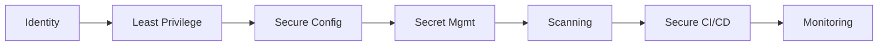

 

**[About](#about)** · **[Stack](#tech-stack)** · **[Projects](#featured-work)** · **[Certifications](#certifications)** · **[Vision](#the-road-ahead)** · **[Connect](#connect)**

---

## About

|                   |                                                                          |
| ----------------- | ------------------------------------------------------------------------ |
| 🧭 **Focus**       | Cloud Infrastructure · IaC · Containers · Kubernetes · CI/CD · DevSecOps |
| 🏗️ **Building**   | Independently designed, production-style systems — not tutorial copies  |
| 🎓 **Trained via** | Structured DevOps bootcamp + applied, self-directed project work         |
| ☁️ **Cloud**       | AWS (EC2, ECR, IAM, CloudWatch)                                          |
| 🔐 **Security**    | Security-by-design — engineered in, not bolted on after                  |
| 🧠 **Philosophy**  | If it only works while I'm watching it, it isn't finished                |
| 📍 **Based in**    | Nigeria — open to remote & relocation                                    |

---

## Currently Focused On

| 🏗️ **IaC** | ☸️ **Kubernetes** | 🔄 **CI/CD** | 📊 **Observability** |
| ----------- | ------------------ | ------------- | ---------------------- |
| Terraform, CloudFormation | Deployments, Helm, StatefulSets | Jenkins, GitHub Actions | Prometheus, Grafana |

---

## Tech Stack

---

## Featured Work

| **🏗️ [Terraform Complete CI/CD](https://github.com/Chukwuemeka-Peter-Eze/Terraform-complete-cicd)** Version-controlled infrastructure provisioning + continuous delivery pipeline. | **☸️ [Kubernetes Microservices](https://github.com/Chukwuemeka-Peter-Eze/Kubernetes-microservices-production)** Multi-service app on Kubernetes — Services, ConfigMaps, Secrets, StatefulSets, Helm. |
| --- | --- |
| **🔧 [AWS + Jenkins CI/CD](https://github.com/Chukwuemeka-Peter-Eze/Aws-jenkins-cicd-pipeline)** Automated delivery pipeline from source control to AWS deployment targets. | **📊 [Prometheus Monitoring Stack](https://github.com/Chukwuemeka-Peter-Eze/Prometheus-monitoring-stack)** Metrics, alerting, and operational visibility for running infrastructure. |
| **🏗️ [Ansible + Terraform](https://github.com/Chukwuemeka-Peter-Eze/Ansible-terraform-integration)** Provisioning paired with configuration automation. | **🐳 [AWS ECR + Docker Registry](https://github.com/Chukwuemeka-Peter-Eze/Aws-ecr-docker-registry)** Container image management and cloud-native workflows. |

---

## Certifications

| ☁️ **DevOps & Cloud Fundamentals** TechWorld with Nana | 🔐 **Cloud Security & DevOps Engineer** Digital Witch Support Community |
| --- | --- |

📎 Certificate images: [`/assets/certificates`](https://github.com/Chukwuemeka-Peter-Eze/Chukwuemeka-Peter-Eze/tree/main/assets/certificates) *(upload files here — see note below)*

---

## Security Mindset

> Build systems that are difficult to misuse, easy to observe, and repeatable to operate.

---

## Activity

 

---

## The Road Ahead

> Growing into an engineer trusted to build, automate, secure, and scale infrastructure that real teams and real products depend on — not by copying a stack, but by earning every line of it through hands-on systems work.

💡 Open to conversations on DevOps, Cloud Infrastructure, Platform Engineering & DevSecOps.

---

## Connect

---

